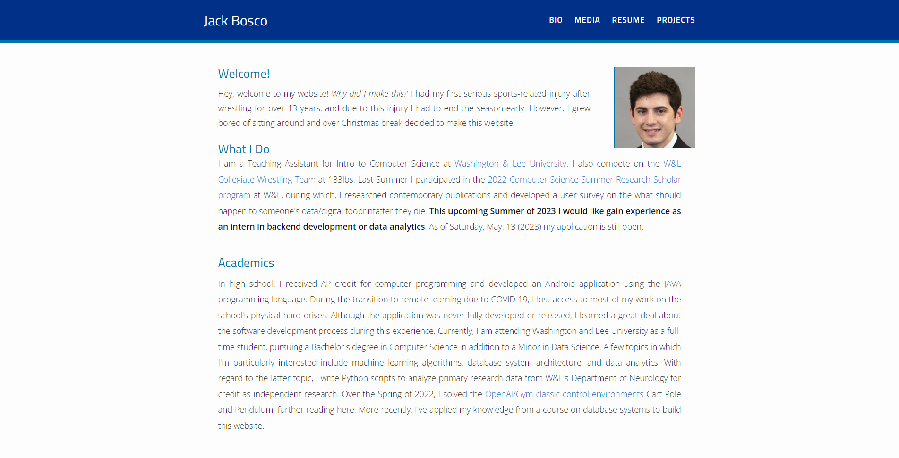
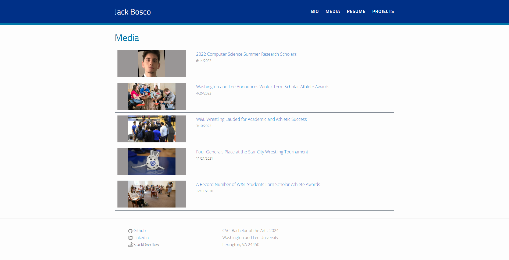
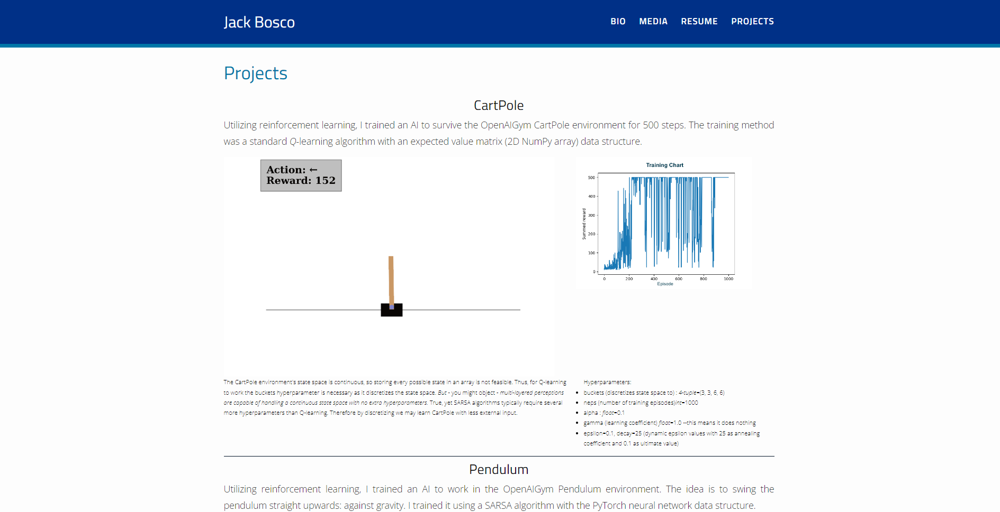
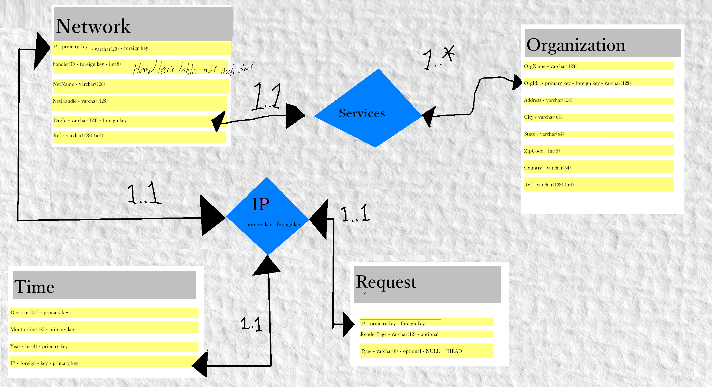

# My Personal Website

Hello, this repo contains a project of mine where I created my personal website.

My website does not have a dedicated URL at the moment but feel free to check it out here,
 or clone the repo and launch the site locally.

## BIO / Home Page



## Media



## Projects



---

## Database



This website also collects data on client requests and stores that data in a SQLite DB.
Data collected includes IP, Request type, and datetime.

---

To launch the website locally, clone the repo then run

```bash
python3 -m flask run
```

in the base directory. 